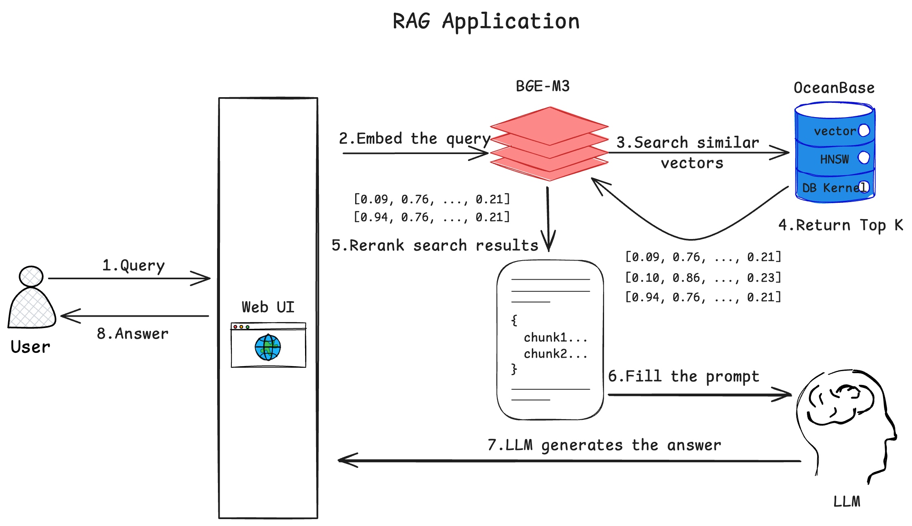
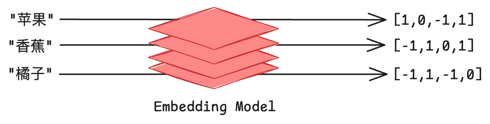
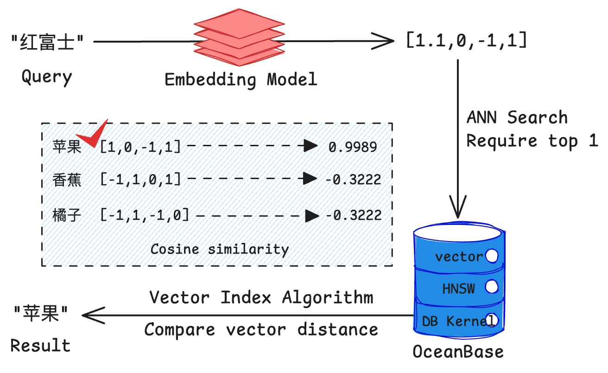
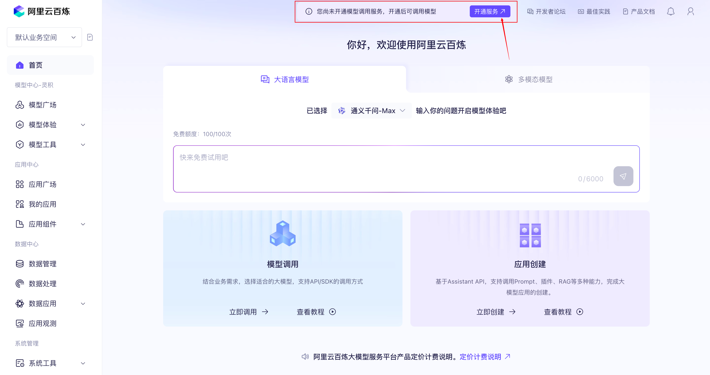
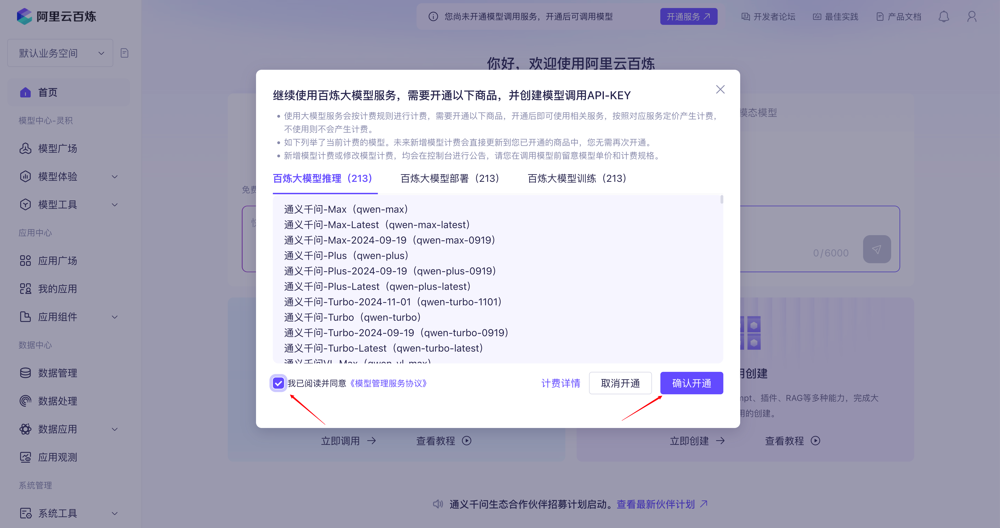
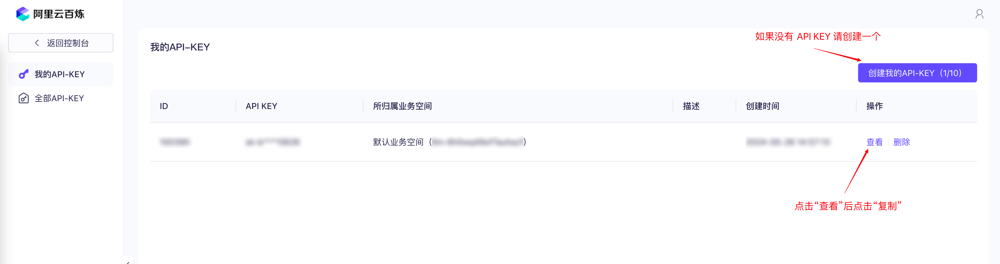
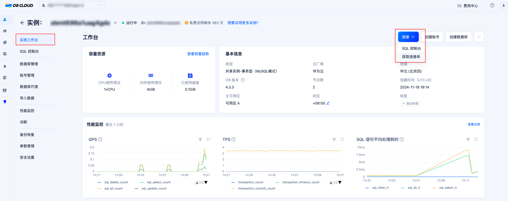
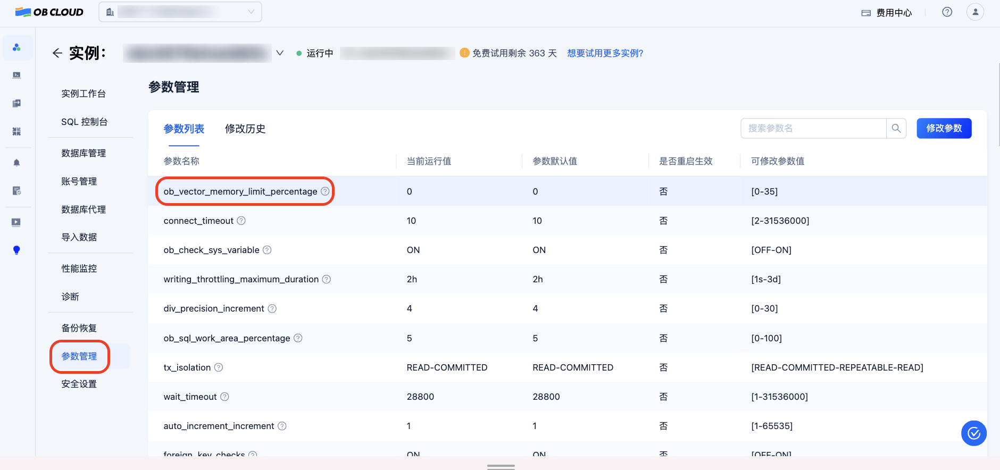
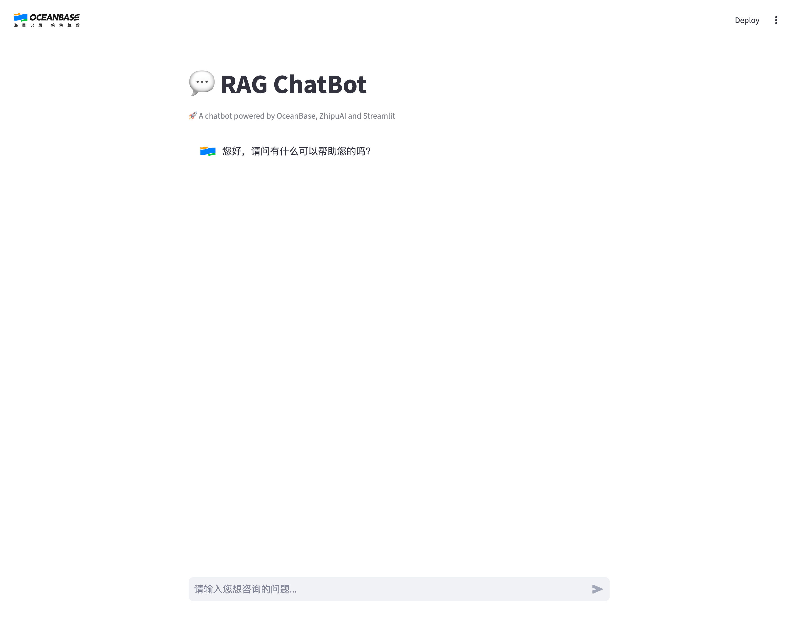

# OceanBase AI Workshop

[中文版](./README_zh.md)

## Introduction

In this workshop, we will build a RAG chatbot that answers questions related to OceanBase documentation. It uses open-source OceanBase documentation repositories as multi-modal data sources, converting documents into vectors and structured data stored in OceanBase. When users ask questions, the chatbot converts their questions into vectors and performs vector retrieval in the database. By combining the retrieved document content with the user's questions, it leverages Tongyi Qianwen's large language model capabilities to provide more accurate answers.

### Components

The chatbot consists of the following components:

1. A text embedding service that converts documents into vectors, using Tongyi Qianwen's embedding API
2. A database that provides storage and query capabilities for document vectors and other structured data, using OceanBase 4.3.3
3. Several LLM agents that analyze user questions and generate answers based on retrieved documents and questions, built with Tongyi Qianwen's large model capabilities
4. A chat interface for user interaction, built with Streamlit

### Interaction Flow



1. User inputs a question in the Web interface and sends it to the chatbot
2. The chatbot converts the user's question into a vector using a text embedding model
3. Uses the vector converted from the user's question as input to retrieve the most similar vectors in OceanBase
4. OceanBase returns the most similar vectors and their corresponding document content
5. The chatbot sends the user's question and retrieved documents to the large language model and requests it to generate an answer
6. The large language model returns the answer in chunks, streaming fashion
7. The chatbot displays the received answer in chunks, streaming fashion on the Web interface, completing one round of Q&A

## Concepts

### What is Text Embedding?

Text embedding is a technique that converts text into numerical vectors. These vectors can capture the semantic information of text, enabling computers to "understand" and process the meaning of text. Specifically:

- Text embedding maps words or sentences to points in a high-dimensional vector space
- In this vector space, semantically similar texts are mapped to nearby locations
- Vectors typically consist of hundreds of numbers (e.g., 512 dimensions, 1024 dimensions)
- Vector similarity can be calculated using mathematical methods (e.g., cosine similarity)
- Common text embedding models include Word2Vec, BERT, BGE, etc.

In this project, we use Tongyi Qianwen's text embedding model to generate vector representations of documents, which will be stored in OceanBase database for subsequent similarity retrieval.

For example, when using an embedding model to convert "apple", "banana", and "orange" into 4-dimensional vectors, their vector representations might look like the diagram below. Note that we reduced the vector dimensions to 4 for easier visualization - in practice, text embedding vectors usually have hundreds or thousands of dimensions. For instance, the text-embedding-v3 model we use from Tongyi Qianwen produces 1024-dimensional vectors.



### What is Vector Retrieval?

Vector retrieval is a technique for quickly finding the most similar vectors to a query vector in a vector database. Its key features include:

- Search based on vector distance (e.g., Euclidean distance) or similarity (e.g., cosine similarity)
- Typically uses Approximate Nearest Neighbor (ANN) algorithms to improve retrieval efficiency
- OceanBase 4.3.3 supports the HNSW algorithm, which is a high-performance ANN algorithm
- ANN can quickly find the most similar results approximately from millions or even billions of vectors
- Compared to traditional keyword search, vector retrieval better understands semantic similarity

OceanBase has added excellent support for "vector" as a data type in its relational database model, enabling efficient storage and retrieval of both vector data and conventional structured data in a single database. In this project, we use OceanBase's HNSW (Hierarchical Navigable Small World) vector index to implement efficient vector retrieval, helping us quickly find the most relevant document fragments for user questions.

If we use "Fuji" as a query text in an OceanBase database that already has embeddings for "apple", "banana", and "orange", we might get results like the diagram below, where the similarity between "apple" and "Fuji" is highest. (Assuming we use cosine similarity as the similarity measure)



### What is RAG?

RAG (Retrieval-Augmented Generation) is a hybrid architecture that combines retrieval systems with generative AI to improve the accuracy and reliability of AI responses. The workflow consists of:

1. Retrieval Phase:

- Convert user questions into vectors
- Retrieve relevant documents from the knowledge base
- Select the most relevant document fragments

2. Generation Phase:

- Provide retrieved documents as context to the large language model
- Generate answers based on questions and context
- Ensure answer sources are traceable

Key advantages of RAG:

- Reduces hallucination problems in large language models
- Can utilize latest knowledge and domain-specific information
- Provides verifiable and traceable answers
- Suitable for building domain-specific Q&A systems

Training and releasing large language models takes considerable time, and training data stops updating once training begins. While the amount of information in the real world continues to increase constantly, it's unrealistic to expect language models to spontaneously master the latest information after being "unconscious" for several months. RAG essentially gives large models a "search engine", allowing them to acquire new knowledge input before answering questions, which typically significantly improves the accuracy of generated responses.

## Prerequisites

Notes: If you are participating in the OceanBase AI Workshop, you can skip steps 1 ~ 4 below. All required software is already prepared on the machine. :)

1. Install [Python 3.9+](https://www.python.org/downloads/) and [pip](https://pip.pypa.io/en/stable/installation/). If the version of Python on your machine is lower than 3.9, you can use Miniconda to create a new environment with Python 3.9. Refer to the [Miniconda installation guide](https://docs.anaconda.com/miniconda/install/) for details.

2. Install [Poetry](https://python-poetry.org/docs/) with command `python3 -m pip install poetry`

3. Install [Docker](https://docs.docker.com/engine/install/) (Optional, only required if you want to run OceanBase in a Docker container)

4. Install MySQL client, using `yum install -y mysql` or `apt-get install -y mysql-client` (Optional, only required if you want to test database connection with MySQL client)

5. Ensure your project code is up to date, recommended to run `git pull` in the project directory

6. Register an [Alibaba Cloud Bailian](https://bailian.console.aliyun.com/) account, activate model service and obtain API Key








## Building the Chatbot

### 1. Get an OceanBase Database

First, we need to obtain an OceanBase database version 4.3.3 or above to store our vector data. You can get an OceanBase database through either of these two methods:

1. Use the OB Cloud database free trial instances. For platform registration and instance creation, please refer to [OB Cloud Database 365-Day Free Trial](https://www.oceanbase.com/free-trial); (Recommended)
2. Use Docker to start a standalone OceanBase database. (Alternative option, requires Docker environment, consumes more local resources)

#### 1.1 Using OB Cloud Database Free Trial Version

##### Register and Create an Instance

Visit the [OB Cloud Database 365-Day Free Trial](https://www.oceanbase.com/free-trial) web page, click the "Try Now" button, register and log in to your account, fill in the relevant information, create an instance, and wait for creation to complete.

##### Get Database Instance Connection Information

Go to the "Instance Workbench" on the instance details page, click the "Connect"-"Get Connection String" button to obtain the database connection information. Fill the connection information into the .env file that will be created in subsequent steps.



##### Modify Parameters to Enable Vector Module

Go to "Parameter Management" on the instance details page, and set the `ob_vector_memory_limit_percentage` parameter to 30 to enable the vector module.



#### 1.2 Deploy an OceanBase Database with Docker

##### Start an OceanBase Container

If this is your first time logging into the machine provided by the workshop, you need to start the Docker service with:

```bash
systemctl start docker
```

Then you can start an OceanBase docker container with:

```bash
docker run --name=ob433 -e MODE=mini -e OB_MEMORY_LIMIT=8G -e OB_DATAFILE_SIZE=10G -e OB_CLUSTER_NAME=ailab2024 -e OB_SERVER_IP=127.0.0.1 -p 127.0.0.1:2881:2881 -d quay.io/oceanbase/oceanbase-ce:4.3.3.1-101000012024102216
```

If the command executes successfully, it will print the container ID:

```bash
af5b32e79dc2a862b5574d05a18c1b240dc5923f04435a0e0ec41d70d91a20ee
```

##### Check the bootstrap of OceanBase is complete

After the container is started, you can check the bootstrap status of OceanBase with:

```bash
docker logs -f ob433
```

The initialization takes about 2-3 minutes. When you see the following message (the bottom `boot success!` is essential), the bootstrap is complete:

```bash
cluster scenario: express_oltp
Start observer ok
observer program health check ok
Connect to observer ok
Initialize oceanbase-ce ok
Wait for observer init ok
+----------------------------------------------+
|                 oceanbase-ce                 |
+------------+---------+------+-------+--------+
| ip         | version | port | zone  | status |
+------------+---------+------+-------+--------+
| 172.17.0.2 | 4.3.3.1 | 2881 | zone1 | ACTIVE |
+------------+---------+------+-------+--------+
obclient -h172.17.0.2 -P2881 -uroot -Doceanbase -A

cluster unique id: c17ea619-5a3e-5656-be07-00022aa5b154-19298807cfb-00030304

obcluster running

...

check tenant connectable
tenant is connectable
boot success!
```

Press `Ctrl+C` to exit the log view.

##### Test deployment (Optional)

Connect to the OceanBase cluster with mysql client to check the deployment.

```bash
mysql -h127.0.0.1 -P2881 -uroot@test -A -e "show databases"
```

If the deployment is successful, you will see the following output:

```bash
+--------------------+
| Database           |
+--------------------+
| information_schema |
| mysql              |
| oceanbase          |
| test               |
+--------------------+
```

### 2. Install dependencies

First of all, you need to change to the directory of the workshop project:

```bash
cd ~/ai-workshop-2024
```

We use Poetry to manage the dependencies of the chatbot project. You can install the dependencies with the following command:

```bash
poetry install
```

If you are using the machine provided by the workshop, you will probably see the following message because the dependencies are already installed in the machine:

```bash
Installing dependencies from lock file

No dependencies to install or update
```

### 3. Set up environment variables

We prepare a `.env.example` file that contains the environment variables required for the chatbot. You can copy the `.env.example` file to `.env` and update the values in the `.env` file.

```bash
cp .env.example .env
# Update the .env file with the correct values, especially the API_KEY and database information
vi .env
```

The content of `.env.example` is as follows, you only need to update the `API_KEY` and `OPENAI_EMBEDDING_API_KEY` with the value you get from the Bailian dashboard if you are following the workshop steps which will take LLMs from Tongyi Qwen. If you are using the OB Cloud instance, update the database-related environment variables starting with `DB_` accordingly. After updating the `.env` file, save and exit the editor.

```bash
API_KEY=xxxxxxxxxxxxxxxxxxxxxxxxxxxxxxxx # Fill your API Key
LLM_MODEL="qwen-turbo-2024-11-01"
LLM_BASE_URL="https://dashscope.aliyuncs.com/compatible-mode/v1"

HF_ENDPOINT=https://hf-mirror.com
BGE_MODEL_PATH=BAAI/bge-m3

OLLAMA_URL=
OLLAMA_TOKEN=

OPENAI_EMBEDDING_API_KEY= # Fill your API Key
OPENAI_EMBEDDING_BASE_URL="https://dashscope.aliyuncs.com/compatible-mode/v1"
OPENAI_EMBEDDING_MODEL=text-embedding-v3

UI_LANG="zh"

# If you are using the OB Cloud instance, update the following database-related environment variables accordingly
DB_HOST="127.0.0.1" 
DB_PORT="2881"
DB_USER="root@test"
DB_NAME="test"
DB_PASSWORD=""
```

### 4. Connect to the Database

You can use our prepared script to try connecting to the database to ensure database-related environment variables are set correctly:

```bash
bash utils/connect_db.sh
# If you successfully enter the MySQL connection, this verifies that the database-related environment variables are set correctly.
```

### 5. Prepare Document Data

In this step, we will clone the open-source documentation repositories of OceanBase components and process them to generate document vectors and other structured data, which will then be inserted into the OceanBase database we deployed in step 1.

#### 5.1 Clone Document Repositories

First, we'll use git to clone the documentation for the oceanbase project locally.

```bash
git clone --single-branch --branch V4.3.4 https://github.com/oceanbase/oceanbase-doc.git doc_repos/oceanbase-doc
# If your network is slow when accessing GitHub, you can use the following command to clone the repository from Gitee
git clone --single-branch --branch V4.3.4 https://gitee.com/oceanbase-devhub/oceanbase-doc.git doc_repos/oceanbase-doc
```

#### 5.2 Document Format Standardization

Since some files in OceanBase's open-source documentation use `====` and `----` to represent level 1 and level 2 headings, in this step we'll convert them to the standard `#` and `##` representation.

```bash
# Convert document headings to standard markdown format
poetry run python convert_headings.py doc_repos/oceanbase-doc/zh-CN
```

#### 5.3 Convert Documents to Vectors and Insert into OceanBase

We provide the `embed_docs.py` script which, when given a document directory and corresponding component, will traverse all markdown documents in the directory, split long documents into chunks, convert them into vectors using the embedding model, and finally insert the document chunk content, embedded vectors, and chunk metadata (in JSON format, including document title, relative path, component name, chunk title, cascading titles) together into the same table in OceanBase, ready for querying.

In order to save time, we will only process a few documents related to vector retrieval. After opening the chat interface in step 6, the questions you ask about vector retrieval functionality of OceanBase will receive more accurate answers.

```bash
# Generate document vectors and metadata
poetry run python embed_docs.py --doc_base doc_repos/oceanbase-doc/zh-CN/640.ob-vector-search
```

While waiting for the text processing, we can examine the contents of `embed_docs.py` to see how it works.

First, the file instantiates two objects: one is the embedding service `embeddings` responsible for converting text content into vector data; the other is OceanBase's LangChain Vector Store service, which encapsulates pyobvector (OceanBase's vector retrieval SDK) and provides simple, user-friendly interface methods. We've also established partition keys for OceanBase components to greatly improve efficiency when querying documents for specific components.

```python
embeddings = get_embedding(
    ollama_url=os.getenv("OLLAMA_URL") or None,
    ollama_token=os.getenv("OLLAMA_TOKEN") or None,
    base_url=os.getenv("OPENAI_EMBEDDING_BASE_URL") or None,
    api_key=os.getenv("OPENAI_EMBEDDING_API_KEY") or None,
    model=os.getenv("OPENAI_EMBEDDING_MODEL") or None,
)

vs = OceanBase(
    embedding_function=embeddings, # Pass in embedding service, called immediately when inserting documents
    table_name=args.table_name,
    connection_args=connection_args,
    metadata_field="metadata",
    extra_columns=[Column("component_code", Integer, primary_key=True)],
    partitions=ObListPartition(
        is_list_columns=False,
        list_part_infos=[RangeListPartInfo(k, v) for k, v in cm.items()]
        + [RangeListPartInfo("p10", "DEFAULT")],
        list_expr="component_code",
    ),
    echo=args.echo,
)
```

Next, the script checks if the vector functionality module is enabled in the connected OceanBase cluster, and if not, enables it using SQL commands.

```python
# Check if vector module is enabled by querying ob_vector_memory_limit_percentage parameter
params = vs.obvector.perform_raw_text_sql(
    "SHOW PARAMETERS LIKE '%ob_vector_memory_limit_percentage%'"
)
# ...

# Enable vector module by setting ob_vector_memory_limit_percentage parameter to 30
vs.obvector.perform_raw_text_sql(
  "ALTER SYSTEM SET ob_vector_memory_limit_percentage = 30"
)
```

Finally, we traverse the document directory, read and chunk the document content, and submit it to OceanBase Vector Store for embedding and storage.

```python
if args.doc_base is not None:
    loader = MarkdownDocumentsLoader(
        doc_base=args.doc_base,
        skip_patterns=args.skip_patterns,
    )
    batch = []
    for doc in loader.load(limit=args.limit):
        if len(batch) == args.batch_size:
            insert_batch(batch, comp=args.component)
            batch = []
        batch.append(doc)

    if len(batch) > 0:
        insert_batch(batch, comp=args.component)
```

### 6. Start the Chat UI

Execute the following command to start the chat UI:

```bash
poetry run streamlit run --server.runOnSave false chat_ui.py
```

Visit the URL displayed in the terminal to open the chatbot application UI.

```bash
  You can now view your Streamlit app in your browser.

  Local URL: http://localhost:8501
  Network URL: http://172.xxx.xxx.xxx:8501
  External URL: http://xxx.xxx.xxx.xxx:8501 # This is the URL you can access from your browser
```



## FAQ

### 1. How to change the LLM model used for generating responses?

You can change the LLM model by updating the `LLM_MODEL` environment variable in the `.env` file, or by modifying the "Large Language Model" in the left sidebar of the chat interface. The default value is `qwen-turbo-2024-11-01`, which is a recently released model from Tongyi Qianwen with a relatively high free quota. Other available models include `qwen-plus`, `qwen-max`, `qwen-long`, etc. You can find the complete list of available models in the [Alibaba Cloud Bailian website](https://bailian.console.aliyun.com/)'s model marketplace. Please note the free quotas and pricing standards.

### 2. Can I update document data after initial loading?

Of course. You can insert new document data by running the `embed_docs.py` script. For example:

```bash
# This will embed all markdown files in the current directory, including README.md and LEGAL.md
poetry run python embed_docs.py --doc_base .

# Or you can specify the table to insert data into
poetry run python embed_docs.py --doc_base . --table_name my_table
```

Then you can specify the `TABLE_NAME` environment variable before launching the chat interface to specify which table the chatbot will query:

```bash
TABLE_NAME=my_table poetry run streamlit run --server.runOnSave false chat_ui.py
```

### 3. How to see the SQL statements executed by the database during embedding and retrieval?

When inserting documents yourself, you can set the `--echo` flag to see the SQL statements executed by the script:

```bash
poetry run python embed_docs.py --doc_base . --table_name my_table --echo
```

You will see output like this:

```bash
2024-10-16 03:17:13,439 INFO sqlalchemy.engine.Engine
CREATE TABLE my_table (
        id VARCHAR(4096) NOT NULL,
        embedding VECTOR(1024),
        document LONGTEXT,
        metadata JSON,
        component_code INTEGER NOT NULL,
        PRIMARY KEY (id, component_code)
)
...
```

You can also set `ECHO=true` before launching the chat UI to see the SQL statements executed by the chat UI.

```bash
ECHO=true TABLE_NAME=my_table poetry run streamlit run --server.runOnSave false chat_ui.py
```

### 4. Why don't changes to the .env file take effect after starting the UI service?

If you edit the .env file or code files, you need to restart the UI service for the changes to take effect. You can terminate the service with `Ctrl + C`, then run `poetry run streamlit run --server.runOnSave false chat_ui.py` again to restart the service.

### 5. How to change the language of the chat UI?

You can change the language of the chat interface by updating the `UI_LANG` environment variable in the `.env` file. The default value is `zh`, which means Chinese. You can change it to `en` to switch to English. You need to restart the UI after updating for the changes to take effect.
