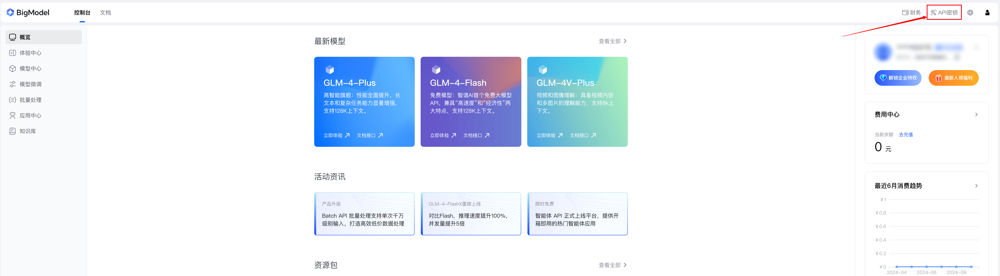
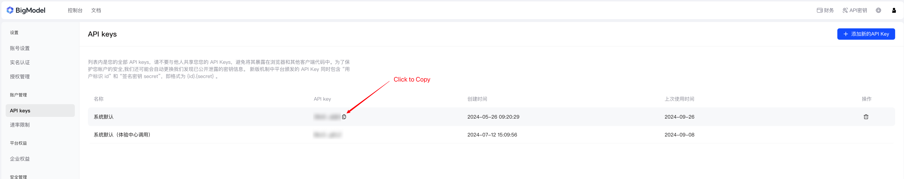

# OceanBase AI Workshop

[中文版](./README_zh.md)

## Introduction

In this workshop, we will build a simple chatbot that answers questions related to OceanBase documentation with RAG (Retrieval Augmented Generation) pattern. It takes open source documentation repos of OceanBase as source of multi modal data, transforms the documents into vectors and structured data and stores them in OceanBase. When a user asks a question, the chatbot retrieves the relevant documents from the database and generates answers based on the retrieved documents and the questions with LLM ability from Zhipu AI.

1. A text embedding model that converts the documents into vectors, BGE-M3
2. A database that offers abilities to store and query vectors and metadata of the documents, OceanBase
3. Several LLM agents that analyze user's questions and generate answers based on the retrieved documents and the questions. (With help of Zhipu AI)
4. A chat UI that interacts with the user. (Built with Streamlit)


## Prerequisites

Notes: If you are participating in the OceanBase AI Workshop, you can skip the following step 1 ~ 3. All the required software are already prepared for you. :)

1. Install [Python 3.9+](https://www.python.org/downloads/) and [pip](https://pip.pypa.io/en/stable/installation/)

2. Install [Poetry](https://python-poetry.org/docs/)

```bash
python3 -m pip install poetry
```

3. Install [Docker](https://docs.docker.com/engine/install/)

4. Register an account for [Zhipu AI](https://open.bigmodel.cn/) and get the API key





## Steps to Build the Chatbot

### 1. Deploy an OceanBase Cluster

#### 1.1 Start an OceanBase docker container

If you are the first time to login to the machine provided by the workshop, you need to start the docker service with the following command:

```bash
systemctl start docker
```

And then, you can start an OceanBase docker container with the following command:

```bash
docker run --ulimit stack=4294967296 --name=ob433 -e MODE=mini -e OB_MEMORY_LIMIT=8G -e OB_DATAFILE_SIZE=10G -p 127.0.0.1:2881:2881 -d quay.io/oceanbase/oceanbase-ce:4.3.3.0-100000142024101215
```

If the above command is executed successfully, you will see the following output:

```bash
af5b32e79dc2a862b5574d05a18c1b240dc5923f04435a0e0ec41d70d91a20ee
```

#### 1.2 Check the bootstrap of OceanBase is complete

After the container is started, you can check the bootstrap status of OceanBase with the following command:

```bash
docker logs -f ob433
```

The initialization will take about 2 ~ 3 minutes. When you see the following message (the bottom `boot success!` is essential), the bootstrap of OceanBase is complete:

```bash
cluster scenario: express_oltp
Start observer ok
observer program health check ok
Connect to observer ok
Initialize oceanbase-ce ok
Wait for observer init ok
+----------------------------------------------+
|                 oceanbase-ce                 |
+------------+---------+------+-------+--------+
| ip         | version | port | zone  | status |
+------------+---------+------+-------+--------+
| 172.17.0.2 | 4.3.3.0 | 2881 | zone1 | ACTIVE |
+------------+---------+------+-------+--------+
obclient -h172.17.0.2 -P2881 -uroot -Doceanbase -A

cluster unique id: c17ea619-5a3e-5656-be07-00022aa5b154-19298807cfb-00030304

obcluster running
Trace ID: 08f99c98-8c37-11ef-ad07-0242ac110002
If you want to view detailed obd logs, please run: obd display-trace 08f99c98-8c37-11ef-ad07-0242ac110002
Get local repositories and plugins ok
Open ssh connection ok
Connect to observer ok
Create tenant test ok
Exec oceanbase-ce-4.3.3.0-100000142024101215.el8-3eee13839888800065c13ffc5cd7c3e6b12cb55c import_time_zone_info.py ok
Exec oceanbase-ce-4.3.3.0-100000142024101215.el8-3eee13839888800065c13ffc5cd7c3e6b12cb55c import_srs_data.py ok
obclient -h172.17.0.2 -P2881 -uroot@test -Doceanbase -A

optimize tenant with scenario: express_oltp ok
Trace ID: 3c50193c-8c37-11ef-ace2-0242ac110002
If you want to view detailed obd logs, please run: obd display-trace 3c50193c-8c37-11ef-ace2-0242ac110002
check tenant connectable
tenant is connectable
boot success!
```

Type `Ctrl+C` to exit the log view.

#### 1.3 Test deployment (Optional)

Connect to the OceanBase cluster with mysql client to check the deployment.

```bash
mysql -h127.0.0.1 -P2881 -uroot@test -A -e "show databases"
```

If the deployment is successful, you will see the following output:

```bash
+--------------------+
| Database           |
+--------------------+
| information_schema |
| mysql              |
| oceanbase          |
| test               |
+--------------------+
```

### 2. Install dependencies

First of all, you need to change to the directory of the workshop project:

```bash
cd ~/ai-workshop-2024
```

We use Poetry to manage the dependencies of the chatbot project. You can install the dependencies with the following command:

```bash
poetry install
```

If you are using the machine provided by the workshop, you will probably see the following message because the dependencies are already installed in the machine:

```bash
Installing dependencies from lock file

No dependencies to install or update
```

### 3. Set up environment variables

We prepare a `.env.example` file that contains the environment variables required for the chatbot. You can copy the `.env.example` file to `.env` and update the values in the `.env` file.

```bash
cp .env.example .env
# Update the .env file with the correct values, especially the API_KEY and database information
vi .env
```

The content of `.env.example` is as follows, you only need to update the `API_KEY` with the value you get from the Zhipu AI dashboard if you are following the workshop steps which will take LLMs from Zhipu AI. The other values can be kept as default values.

```bash
API_KEY=xxxxxxxxxxxxxxxxxxxxxxxxxxxxxxxx # Update this with the API key from Zhipu AI
LLM_BASE_URL="https://open.bigmodel.cn/api/paas/v4/"
LLM_MODEL="glm-4-flash"

HF_ENDPOINT=https://hf-mirror.com
BGE_MODEL_PATH=BAAI/bge-m3

DB_HOST="127.0.0.1"
DB_PORT="2881"
DB_USER="root@test"
DB_NAME="test"
DB_PASSWORD=""
```

### 4. Prepare BGE-M3 model

BGE-M3 is a pre-trained model that can convert the texts into vectors. It performs well in embedding multiple languages and can be used to embed the documents into vectors in this workshop.

Execute the following command to prepare the BGE-M3 model:

```bash
poetry run python utils/prepare_bgem3.py
```

The size of BGE-M3 model is about 2 ~ 3 GB, so it will take some time to download it which depends on network situation. If the model is already downloaded, this step takes about half a minute to load the model. When the model is ready, you will see the following message:

```bash
Fetching 30 files: 100%|████████████████████████████████████████████████████████████████| 30/30 [00:00<00:00, 104509.24it/s]
/root/.cache/pypoetry/virtualenvs/ai-workshop-aLQYZfdO-py3.10/lib/python3.10/site-packages/FlagEmbedding/BGE_M3/modeling.py:335: FutureWarning: You are using `torch.load` with `weights_only=False` (the current default value), which uses the default pickle module implicitly. It is possible to construct malicious pickle data which will execute arbitrary code during unpickling (See https://github.com/pytorch/pytorch/blob/main/SECURITY.md#untrusted-models for more details). In a future release, the default value for `weights_only` will be flipped to `True`. This limits the functions that could be executed during unpickling. Arbitrary objects will no longer be allowed to be loaded via this mode unless they are explicitly allowlisted by the user via `torch.serialization.add_safe_globals`. We recommend you start setting `weights_only=True` for any use case where you don't have full control of the loaded file. Please open an issue on GitHub for any issues related to this experimental feature.
  colbert_state_dict = torch.load(os.path.join(model_dir, 'colbert_linear.pt'), map_location='cpu')
/root/.cache/pypoetry/virtualenvs/ai-workshop-aLQYZfdO-py3.10/lib/python3.10/site-packages/FlagEmbedding/BGE_M3/modeling.py:336: FutureWarning: You are using `torch.load` with `weights_only=False` (the current default value), which uses the default pickle module implicitly. It is possible to construct malicious pickle data which will execute arbitrary code during unpickling (See https://github.com/pytorch/pytorch/blob/main/SECURITY.md#untrusted-models for more details). In a future release, the default value for `weights_only` will be flipped to `True`. This limits the functions that could be executed during unpickling. Arbitrary objects will no longer be allowed to be loaded via this mode unless they are explicitly allowlisted by the user via `torch.serialization.add_safe_globals`. We recommend you start setting `weights_only=True` for any use case where you don't have full control of the loaded file. Please open an issue on GitHub for any issues related to this experimental feature.
  sparse_state_dict = torch.load(os.path.join(model_dir, 'sparse_linear.pt'), map_location='cpu')

===================================
BGEM3FlagModel loaded successfully！
===================================
```

### 5. Prepare document data

#### 5.1 Download pre-processed data and load it (Fast, for Workshop Only)

In this step, we will load the pre-processed document data into the oceanbase database.

```bash
# Load the pre-processed document data
poetry run python utils/load.py --source_file ~/data.json
```

It will take about 2 minutes to load data. The following output is expected: (The SAWarnings can be ignored)

```bash
args Namespace(table_name='corpus', source_file='/root/data.json', skip_create=False, insert_batch=100)
  0%|                                                                                                                                                                                                                                                          | 0/27412 [00:00<?, ?it/s]
/root/.cache/pypoetry/virtualenvs/ai-workshop-aLQYZfdO-py3.10/lib/python3.10/site-packages/pyobvector/client/ob_vec_client.py:329: SAWarning: Unknown schema content: '  VECTOR KEY `vidx` (`embedding`) WITH (DISTANCE=L2,M=16,EF_CONSTRUCTION=256,LIB=VSAG,TYPE=HNSW, EF_SEARCH=64) BLOCK_SIZE 16384'
  table = Table(table_name, self.metadata_obj, autoload_with=self.engine)
100%|██████████████████████████████████████████████████████████████████| 27412/27412 [01:44<00:00, 262.02it/s]
```

Notes: The `data.json` file is a pre-processed document data file that contains the document vectors and metadata. It was generated by step 5.2. If you want to generate the file by yourself, please go to step 5.2.

#### 5.2 Clone document repositories and process them (Slow)

Notes: This step may take a few hours or even longer to complete on CPU-only machine.

In this step, we will clone the OceanBase document repositories and process them to generate the document vectors and metadata, which will be saved into the OceanBase database we deployed in step 1.

```bash
cd doc_repos
git clone --single-branch --branch V4.3.3 https://github.com/oceanbase/oceanbase-doc.git
git clone --single-branch --branch V4.3.0 https://github.com/oceanbase/ocp-doc.git
git clone --single-branch --branch V4.3.1 https://github.com/oceanbase/odc-doc.git
git clone --single-branch --branch V4.2.5 https://github.com/oceanbase/oms-doc.git
git clone --single-branch --branch V2.10.0 https://github.com/oceanbase/obd-doc.git
git clone --single-branch --branch V4.3.0 https://github.com/oceanbase/oceanbase-proxy-doc.git
cd ..
```

```bash
# Convert the headings to standard markdown format
poetry run python convert_headings.py \
  doc_repos/oceanbase-doc/zh-CN \
  doc_repos/ocp-doc/zh-CN \
  doc_repos/odc-doc/zh-CN \
  doc_repos/oms-doc/zh-CN \
  doc_repos/obd-doc/zh-CN \
  doc_repos/oceanbase-proxy-doc/zh-CN

# Embeds the documents into vectors
poetry run python embed_docs.py --doc_base doc_repos/oceanbase-doc/zh-CN
poetry run python embed_docs.py --doc_base doc_repos/ocp-doc/zh-CN --component ocp
poetry run python embed_docs.py --doc_base doc_repos/odc-doc/zh-CN --component odc
poetry run python embed_docs.py --doc_base doc_repos/oms-doc/zh-CN --component oms
poetry run python embed_docs.py --doc_base doc_repos/obd-doc/zh-CN --component obd
poetry run python embed_docs.py --doc_base doc_repos/oceanbase-proxy-doc/zh-CN --component odp
```

If you want to extract the data generated and inserted into the database in the above steps and save it in a file named `my-data.json`, you can execute the following command:

```bash
poetry run python utils/extract.py --output_file ~/my-data.json
```

This is the way how we get pre-processed data `data.json`.

### 6. Start the chat UI

Execute the following command to start the chat UI:

```bash
poetry run streamlit run --server.runOnSave false chat_ui.py
```

Visit the URL displayed in the terminal to chat with the chatbot.

```bash
  You can now view your Streamlit app in your browser.

  Local URL: http://localhost:8501
  Network URL: http://172.xxx.xxx.xxx:8501
  External URL: http://xxx.xxx.xxx.xxx:8501 # This is the URL you can visit from your browser
```


## FAQ

### 1. How to change LLM model that used to generate the response?

You can change the LLM model by updating the `LLM_MODEL` environment variable in the `.env` file. The default value is `glm-4-flash`, which is a free model provided by Zhipu AI. There are other models available like `glm-4-air`, `glm-4-plus`, `glm-4-long` etc. You can find the full list of models on the [Zhipu AI website](https://open.bigmodel.cn).

### 2. Can I update the document data after the initial loading?

Of course you can. You can insert new document data by running the `embed_docs.py` script. For example:

```bash
# This will embed all markdown files in the current directory, which contains README.md and LEGAL.md
poetry run python embed_docs.py --doc_base .

# Or you can specify the table to insert data into
poetry run python embed_docs.py --doc_base . --table_name my_table
```

Then you can specify the `TABLE_NAME` environment variable before launch the chat UI to start chat with your own new table:

```bash
TABLE_NAME=my_table poetry run streamlit run --server.runOnSave false chat_ui.py
```

### 3. How to see the SQL statements executed by the database during the embedding and retrieval process?

When you insert documents yourself, you can set the `--echo` flag to see the SQL statements executed by the script like following:

```bash
poetry run python embed_docs.py --doc_base . --table_name my_table --echo
```

You will see the output like this:

```bash
2024-10-16 03:17:13,439 INFO sqlalchemy.engine.Engine
CREATE TABLE my_table (
        id VARCHAR(4096) NOT NULL,
        embedding VECTOR(1024),
        document LONGTEXT,
        metadata JSON,
        component_code INTEGER NOT NULL,
        PRIMARY KEY (id, component_code)
)
...
```

You can also set `ECHO=true` before launch the chat UI to see the SQL statements executed by the chat UI.

```bash
ECHO=true TABLE_NAME=my_table poetry run streamlit run --server.runOnSave false chat_ui.py
```

### 4. Why my modification to the environment variables in the `.env` file after the chat UI has started does not take effect?

You need to restart the chat UI after modifying the `.env` file to make the changes take effect. You can stop the chat UI by pressing `Ctrl+C` in the terminal and then start it again.
